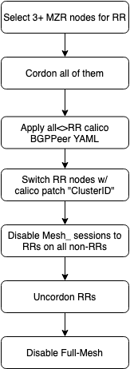

# Calico Route-Reflector Operator

<br>

[IBM GitHub Issue](https://github.ibm.com/alchemy-containers/armada-network/issues/813) <br>
[Calico Project Issue](https://github.com/projectcalico/calico/issues/2382) <br>
[Slides on iBGP](https://ibm.box.com/s/4tkrhcpt8rndn6cvkn0tg2ot0idxsit7) <br>

<br>

- ~~No need for a CRD, the operator should watch core/v1 Node events and modify Calico objects.~~ <br>
- No need for quorum, BGP route reflectos are stateless, they essentially **broadcast** BGP UPDATE messages. <br>
- RR selection must be MZR-aware. <br>
- RR nodes _should_ be cordoned to avoid a network disruption of 1.8s-2.2s. <br>

#### Table of Contents

1. [Initialization](#Initialization)  
1. [Watch](#Watch)
1. [Workflows](#Workflows)
    - [Migration to an RR enabled state](#Migration-to-an-RR-enabled-state)
    - [Switching back to full-mesh sessions from the RR setup](#Switching-back-to-full-mesh-sessions-from-the-RR-setup)
    - [Enabling route-reflection on a node](#Enabling-route-reflection-on-a-node)
    - [Disabling route-reflection on a node](#Disabling-route-reflection-on-a-node)
1. [Dedicated worker-pool or nodes for RRs](#Dedicated-worker-pool-or-nodes-for-RRs)
1. [Minimum Viable Product](#Minimum-Viable-Product)

## Initialization

The operator should verify on initialization whether the RR setup is already enabled on the cluster by checking the calico default BGPConfiguration's `spec.nodeToNodeMeshEnabled` option. If it's RR setup is not yet enabled - the nodeToNodeMeshEnabled is true - the operator should start the [Migration to an RR enabled state](#Migration-to-an-RR-enabled-state) process.

## Watch

Furthermore, it should watch api-version `core/v1`, kind `Node` and/or kind `NodeList` objects and should reconcile on NotReady and SchedulingDisabled node status changes on RR nodes. If an RR node enters one of these states the operator should:
1. start the [Disabling route-reflection on a node](#Disabling-route-reflection-on-a-node) process on the affected node. This can be skipped during Node delete reconciliations.
1. select a new RR node from the same zone as the disabled RR
1. start the [Enabling route-reflection on a node](#Enabling-route-reflection-on-a-node) process on the new RR

## Workflows

### Migration to an RR enabled state

[route_reflector_setup.txt](route_reflector_setup.txt) from the Performance Team



1. Select 3 nodes if nodes<100, 3+nodes/100 otherwise. The selected nodes must be from multiple zones - preferably evenly from each zone - if the cluster is MZR (`ibm-cloud.kubernetes.io/zone`). As BGP RRs are stateless, there's no need for quorum.

```
for n in $(kubectl get nodes -o=name|head -3); do
kubectl label ${n} ibm-cloud.kubernetes.io/route-reflector
done
```

2. Verify the labels were applied properly:

```
kubectl get node -o yaml | grep calico-route -A 20 | grep -e calico-route -e hostname
  - Should see something like:
      ibm-cloud.kubernetes.io/route-reflector: "true"
      kubernetes.io/hostname: 10.x.x.x
      ibm-cloud.kubernetes.io/route-reflector: "true"
      kubernetes.io/hostname: 10.x.x.x
      ibm-cloud.kubernetes.io/route-reflector: "true"
      kubernetes.io/hostname: 10.x.x.x
```

3. To enable RR client mode, the RRs must tear down and re-establish all of their session. Because of how calico configures the sessions (named Mesh_x_x_x_x and Node_x_x_x_x) the RR<>RR session are flapped as well. This causes a 1.8s-2.2s network "blip" on the RR nodes, therefore they must be cordoned:

```
for n in $(kubectl get nodes -l route-reflector=true -o=name); do
k cordon ${n}
done
```

4. Verify nodes are cordoned.

5. Configure the non-RR <-> RR client sessions and the RR <-> RR peer sessions.

```
calicoctl apply -f - <<EOF
kind: BGPPeer
apiVersion: projectcalico.org/v3
metadata:
  name: peer-with-route-reflectors
spec:
  nodeSelector: all()
  peerSelector: ibm-cloud.kubernetes.io/route-reflector == 'true'
EOF
```

6. Patch the `ibm-cloud.kubernetes.io/route-reflector=true` nodes to set them as route reflectors (using their calico name, the worker id):

```
for n in $(kubectl get nodes -l ibm-cloud.kubernetes.io/route-reflector=true -o=name); do
calicoctl patch node $(kubectl get ${n} -oyaml | grep worker-id | awk '{print $2}')  -p '{"spec": {"bgp": {"routeReflectorClusterID": "0.0.0.0"}}}' --config=$C
done
```

7. At this point calico on RRs disabled their full-mesh sessions and have the RR client and RR<>RR sessions only in their BIRD configuration. On the other hand non-RR nodes have both the full-mesh (Mesh_x_x_x_x) and node specific (Node_x_x_x_x) sessions to the RRs configured. Unfortunately it seems to be non-deterministic which of them is Established, thus we have to disable Mesh_ sessions to RR nodes on every node to avoid a 1.8s-2.2s network "blip" on a signification portion of the overlay calico network when we disable the full-mesh, the Mesh_ sessions.

Verify this by:
```
for p in $(kubectl -nkube-system -lk8s-app=calico-node get pods -o=name); do
ks exec -it ${p} -- birdcl -s /var/run/calico/bird.ctl show protocols
done
```

And disable a session with:
```
kubectl -nkube-system exec -it calico-node-2rfjq -- birdcl -s /var/run/calico/bird.ctl disable Mesh_10_94_218_159
```

After this the output of `bird.cl show protocols` should show the Mesh_ `down` and the Node_ sessions to the RRs (in this case .142 and .143) `Established` on the non-RR nodes:
```
Mesh_10_94_218_165 BGP      master   up     2020-05-11  Established
Mesh_10_94_218_248 BGP      master   up     2020-05-11  Established
Mesh_10_94_218_147 BGP      master   up     2020-05-15  Established
Mesh_10_94_218_143 BGP      master   down   10:22:16
Mesh_10_94_218_142 BGP      master   down   10:22:14
Node_10_94_218_142 BGP      master   up     10:22:16    Established
Node_10_94_218_143 BGP      master   up     10:22:18    Established
```

8. Now that the Mesh_ sessions are disabled and the Node_ sessions are enabled between non-RR<>RR and RR<>RR nodes, the RR nodes can be uncordoned, their BGP sessions won't have to be teared down again.

```
for n in $(kubectl get nodes -l route-reflector=true -o=name); do
k uncordon ${n}
done
```

9. As non-RR nodes are clients to the RRs, they have all of the node routes from both the direct non-RR<>non-RR sessions and the RR sessions as well. Therefore the full-mesh Mesh_ sessions can be safely disabled and teared down at this point, the nodes will switch over to the routes from the RRs under 0.1ms (my measurement).

Create the default BGPConfiguration (which will turn off the full node to node mesh):

```
calicoctl apply -f - <<EOF
apiVersion: projectcalico.org/v3
kind: BGPConfiguration
metadata:
  name: default
spec:
  logSeverityScreen: Info
  nodeToNodeMeshEnabled: false
EOF
```

If the default BGPConfiguration already exists, patch it:
calicoctl patch bgpconfiguration default -p '{"spec": {"nodeToNodeMeshEnabled": “false”}}'

10. Command to check that this worked.  The route reflector nodes should have bird connections to all the other nodes.  The non-reflector nodes should only have connections to the route reflector nodes:

```
for i in $(kubectl get pod -n kube-system -l k8s-app=calico-node -o custom-columns=.:metadata.name --no-headers); do
kubectl exec -itn kube-system $i -- ip a s eth0 | grep 10.
kubectl exec -itn kube-system $i -- netstat -anp | grep bird | grep -v STREAM -c
done
```

Kubectl source to drain a node [here](https://github.com/kubernetes/kubectl/tree/master/pkg/drain) and [here](https://github.com/kubernetes/kubectl/blob/master/pkg/cmd/drain/drain.go).

### Switching back to full-mesh sessions from the RR setup

1. Patch the default Calico BGPConfiguration to add the BIRD `Mesh_` full-mesh sessions:
`calicoctl patch BGPConfiguration default -p '{"spec": {"nodeToNodeMeshEnabled": true}}'`
2. Cordon RR nodes.
3. Disable route-reflection and remove the `ibm-cloud.kubernetes.io/route-reflector` labels:
```
calicoctl get node -o yaml | sed '/routeReflectorClusterID/d' | calicoctl apply -f -
kubectl label node --all ibm-cloud.kubernetes.io/route-reflector-
```
4. Remove the non-RR<>RR and RR<>RR, Node_x_x_x_x sessions:
`calicoctl delete BGPPeer peer-with-route-reflectors`
5. Uncordon former RR nodes.

### Enabling route-reflection on a node  

As this changes the current RRs <> new RR sessions from `rr client` back to normal peer sessions and for that a BGP session must be teared down, the new RR node shall be cordoned to avoid a 1.8s-2.2s network "blip" caused by the reeastblishing of its sessions.

1. Add `ibm-cloud.kubernetes.io/route-reflector=true` label
1. Cordon node
1. Patch calico node object with `routeReflectorClusterID: 0.0.0.0`
1. Uncordon node

### Disabling route-reflection on a node

i.e. a node configured as RR got cordoned, it is unreachable or we expect it to become unreachable.

It's important to note that cordoning - -  should be before removing the label as that causes another ~2 seconds network disruption (ping -i0.1 from busybox to a pod on the RR node).

1. Cordon node (if not already)
1. Remove `ibm-cloud.kubernetes.io/route-reflector=true` label
1. Delete `routeReflectorClusterID: 0.0.0.0` configuration from calico node object
1. Uncordon node

## Dedicated worker-pool or nodes for RRs

Another option to avoid the cordoning of the selected RR nodes is to select a dedicated worker pool or nodes that wouldn't run any other workload. In this scenario the tainted nodes wouldn't have to be cordoned, _but_ other steps of the [Migration to an RR enabled state](#Migration-to-an-RR-enabled-state) process still stand, the Mesh_ sessions to RRs have to be disabled before disabling the full-mesh.

The cordoning can be skipped for the [Enabling route-reflection on a node](#Enabling-route-reflection-on-a-node) workflow as well and I can't think of scenario where disabling route-reflection on a node would be necessary. All the non-RR nodes will have all of the cluster routes from every RR, so if an RR goes down they switchover to routes from other RRs.

Rather, the operator ensures there're enough dedicated nodes / nodes in the worker pool at all times and they're all enabled for route-reflection. The number of RRs matter from redundancy point of view only, all they do is copying routes from the non-RR nodes to every other non-RR node. Therefore the operator should aim to have a minimum of 3 nodes in the worker pool, at least 1 in each zone. This provides sufficient redundancy without any SPOF in MZR clusters.

It's important point out that this option - of course - increases the customers's overall bill to their cloud provider. On IKS the least expensive node is 0.11$/h, 79$/mo, 950$/y (w/o any discounts on my account), so the cost of dedicated RR nodes will be 238-475-713$ / mo, depending on the cluster size. My dummy calculations show that this increases the bill of a reasonable sized cluster by 0.15-0.45%.

IBM Cloud Kubernetes Service API endpoint to create a worker pool [here](https://cloud.ibm.com/apidocs/kubernetes#create-a-worker-pool-for-a-cluster).

## RR pods

Calico used to have [something](https://github.com/projectcalico/routereflector) like this, but it's not maintained anymore. As a calico-node already runs on every interface private IP in the cluster...

## Minimum Viable Product

| MVP / POC (IKS implementation)              | Full feature set (Calico implementation)                             |
|---------------------------------------------|----------------------------------------------------------------------|
| Kubernetes Go client | ~same |
| operator-sdk (no signifacnt difference)     | kubebuilder (no signifacnt difference)                               |
| Using exisiting nodes                       | Dedicated worker-pool/nodes w/ IKS Cloud API                         |
| Simple RR selection: e.g. 1 per zone tot. 3 | Scalable RR selection: Single Cluster w/ quorum, Peered, Hierachical |
| calicoctl w/ YAMLs                          | Calico SDK                                                           |
| [?] watch api/core/v1/Node                  | [?] watch Calico objects                                             |

## Difficulties I've found so far with the k8s client-go lib

- Execing in a pod is not supported by client-go, the operator has to connect to kube-api directly, like [this](https://github.com/a4abhishek/Client-Go-Examples/blob/master/exec_to_pod/exec_to_pod.go).

- The `(v1.NodeStatus).Conditions on pkg.go.dev` array's `Ready` element, isn't really a reliable source in itself to determine whether the RR role should be moved away from the node in question. Taints and `{"spec":{"unschedulable":true}}` shall be checked as well.

```
taints:
- effect: NoSchedule
  key: node.kubernetes.io/unschedulable
  timeAdded: "2020-05-18T10:45:09Z"
unschedulable: true
```

- No implementation for cordoning/uncordoning either. But it this might be as simple as adding the aboves ^^
